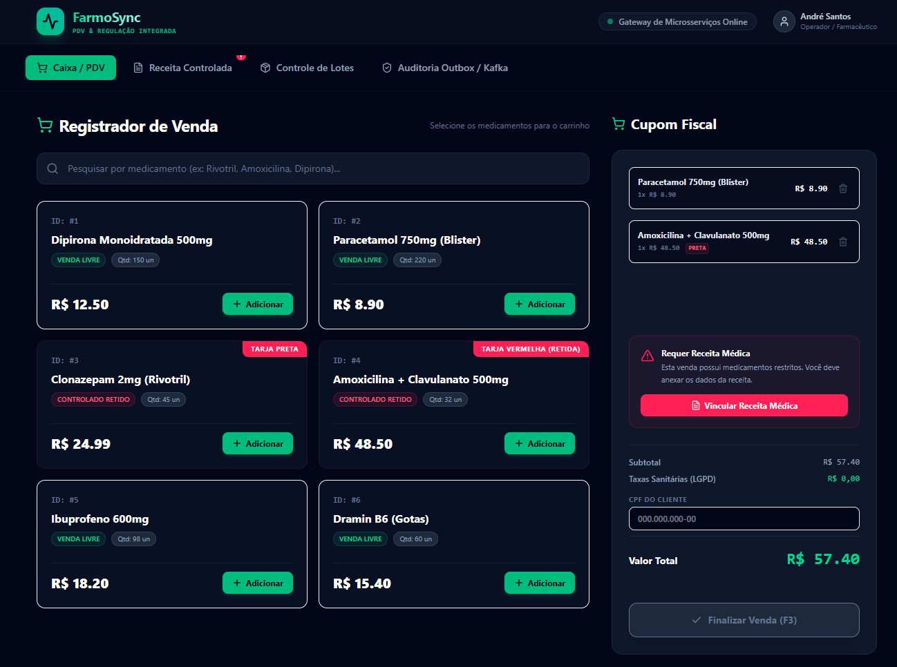

# FarmoSync — Monorepo de Alta Performance para PDV Farmacêutico

[](https://vercel.com)
[](https://confluent.cloud)
[](https://mongodb.com)

O **FarmoSync** é uma arquitetura de referência corporativa de alto nível projetada para gerenciar operações críticas de Ponto de Venda (PDV) e controle sanitário de farmácias. O projeto unifica em um único **Monorepo** microsserviços Spring Boot de alta performance com um frontend moderno e reativo em React 19, utilizando uma arquitetura orientada a eventos (**Event-Driven**) altamente tolerante a falhas.

---

## 📸 Interface do Painel FarmoSync

Abaixo está o painel interativo unificado do FarmoSync em operação, permitindo experimentar e simular as interações físicas dos microsserviços, tópicos do Kafka e banco de dados de Outbox local:



---

## Objetivo do Projeto

Garantir **baixíssima latência de caixa** (faturamento rápido no PDV) e **alta resiliência** operacional de venda, respeitando as complexas regras sanitárias da ANVISA, tais como:
1.  **Medicamentos Controlados:** Validação rigorosa e assíncrona de receitas médicas e registro de profissionais (CRM/UF).
2.  **Rastreabilidade Física Absoluta:** Baixa de estoque baseada em **Lote e Validade** físicos (evitando a venda de lotes vencidos ou inexistentes).
3.  **Transacionalidade e Entrega Garantida:** Garantir que vendas faturadas no caixa nunca sejam perdidas, mesmo em caso de queda física da rede ou de microsserviços parceiros.

---

## Escolhas de Arquitetura

Para suportar esse nível de criticidade e escalabilidade, foi aplicado os seguintes padrões arquiteturais de software:

### 1. Domain-Driven Design (DDD) & Clean Architecture
Cada microsserviço é segmentado em camadas puras. O **Domínio** reside em Java puro (sem framework), blindando as regras matemáticas de faturamento e validação sanitária contra mudanças físicas de bancos de dados ou mensageria.

### 2. Event-Driven Architecture (EDA) com Apache Kafka
Em vez de chamadas HTTP (REST) síncronas que poderiam travar o caixa do PDV se o sistema de auditoria estivesse lento, utilizamos o **Kafka** (Confluent Cloud) para comunicação assíncrona. O checkout é efetuado imediatamente e as baixas de estoque e auditorias sanitárias ocorrem de forma paralela em background.

### 3. Transactional Outbox Pattern
Para evitar a perda de mensagens em caso de oscilações de rede, a gravação da venda e a intenção de publicação da mensagem no Kafka ocorrem em uma transação atômica única no **MongoDB** através de uma coleção de **Outbox**. Um worker assíncrono varre a coleção e garante a entrega *at-least-once* ao broker de mensageria.

### 4. Testes de Integração com Testcontainers
Os testes automatizados sobem contêineres Docker reais do **Kafka** e **MongoDB** durante o build do JUnit, assegurando 100% de paridade de infraestrutura física com o ambiente produtivo.

---

## Stack de Tecnologias

### **Backend (Microsserviços)**
*   **Linguagem & Framework:** Java 17/21, Spring Boot 3.x
*   **Persistência & Dados:** Spring Data MongoDB (Replica Set ativo)
*   **Mensageria:** Spring Kafka, Apache Kafka (KRaft unificado / Confluent Cloud)
*   **Hospedagem & Docker:** Docker Compose multi-stage JRE Alpine, Render
*   **Gerenciador de Dependências:** Maven

### **Frontend (Painel de Simulação & Controle)**
*   **Interface Principal:** React 19, TypeScript
*   **Estilização:** Tailwind CSS v4 
*   **Animações:** Framer Motion (Transições e micro-interações fluidas)
*   **Ícones:** Lucide React
*   **Bundler & Dev Server:** Vite 8
*   **Hospedagem:** Vercel

---

## Recursos Disponíveis e Integrados no Sistema

O frontend do **FarmoSync** foi construído como um **simulador interativo de alta fidelidade** das ações dos microsserviços backend e filas do Kafka:

1.  **Checkout de PDV Inteligente:**
    *   Carrinho de compras dinâmico com regras de descontos.
    *   Máscara automática de CPF e CRM.
    *   Sinalização visual automática de medicamentos controlados (tarja preta) que exigem a vinculação obrigatória de dados médicos.
2.  **Validador Assíncrono de Receitas (Simulação de Lag do Kafka):**
    *   Ao processar receitas, o sistema simula os 2 segundos de lag de fila do barramento de eventos do Kafka.
    *   Se o CRM digitado for `99999`, a receita é rejeitada pelas regras de auditoria; qualquer outro número é aprovado dinamicamente com animação.
3.  **Auditor de Outbox & Reprocessador de DLQ:**
    *   Painel que espelha em tempo real a tabela `OutboxEvent` do MongoDB.
    *   Exibição dos estados de entrega dos eventos (`PENDING`, `SENT`, `FAILED`).
    *   Botão funcional de **Reprocessar DLQ** para forçar o reenvio de eventos com erro de rede ou validação.
4.  **Monitor de Lotes de Estoque:**
    *   Grade de monitoramento de lotes farmacêuticos físicos com indicação de quantidade disponível e validade.
    *   Alertas visuais baseados na proximidade de expiração dos medicamentos.

---

## 📁 Estrutura de Diretórios

```text
java-ms/
├── back/                             # Microsserviços Java (Spring Boot)
│   ├── Dockerfile                    # Dockerfile JRE Alpine de Produção
│   ├── inventory-service/            # Microsserviço de Gestão de Lotes de Estoque
│   ├── pdv-service/                  # Microsserviço de Vendas e API Gateway
│   └── prescription-service/         # Microsserviço de Auditoria Sanitária
├── front/                            # Frontend React 19 + Vite
│   ├── public/                       # Favicon, Ícones e pdv-screen.png
│   ├── src/                          # Código fonte React e estilos Tailwind v4
│   ├── package.json                  # Dependências npm (Vite, Tailwind, Framer Motion)
│   └── vercel.json                   # Configuração de rotas SPA da Vercel
├── docs/                             # Documentação Técnica e Arquitetural
│   ├── decisions/                    # Decisões Arquiteturais Registradas (ADRs 001 a 005)
│   ├── architecture.md               # Índice e Blueprint Arquitetural Global
│   └── deployment-guide.md           # Guia Passo a Passo de Deploy em Nuvem (Confluent/Render)
├── docker-compose.yml                # Docker Compose de Infraestrutura Local (Mongo + Kafka + Kafdrop)
└── README.md                         # Este Documento
```

---

## Como Rodar a Aplicação Localmente

Para rodar o ecossistema FarmoSync na sua máquina local de forma integrada, siga as instruções abaixo.

### 🛠️ Pré-requisitos
*   **Docker & Docker Compose** (para rodar a infraestrutura de dados e mensageria).
*   **Node.js & npm** (para o servidor do frontend).
*   **Java 17 ou superior & Maven** (para compilação e execução dos microsserviços).

---

### Passo 1: Subir a Infraestrutura Base (Docker)
Na raiz do projeto, execute o comando abaixo para iniciar o MongoDB, o Apache Kafka (com Kraft) e o painel visual do Kafdrop em segundo plano:
```bash
docker compose up -d
```
*   *MongoDB:* Ativo e pré-configurado na porta `27017` como Replica Set (`rs0`).
*   *Kafka Broker:* Ativo na porta `9092`.
*   *Kafdrop (Kafka UI):* Acessível em **[http://localhost:9000](http://localhost:9000)** para monitoramento dos tópicos em tempo real.

---

### Passo 2: Inicializar o Frontend (React + Vite)
Navegue até a pasta do frontend, instale as dependências e inicie o servidor de desenvolvimento:
```bash
cd front
npm install
npm run dev
```
*   O frontend estará acessível em **[http://localhost:5173](http://localhost:5173)** com carregamento instantâneo do Tailwind CSS v4 e animações completas.

---

### Passo 3: Executar os Microsserviços Backend (Java + Spring Boot)
Cada um dos microsserviços na pasta `back/` pode ser executado individualmente via Maven ou importado como projeto em sua IDE (IntelliJ IDEA, Eclipse, VS Code):

```bash
# Executando o PDV Service (Porta 8081)
cd back/pdv-service
mvn spring-boot:run

# Executando o Prescription Service (Consumidor Assíncrono do Kafka)
cd back/prescription-service
mvn spring-boot:run

# Executando o Inventory Service (Consumidor Assíncrono do Kafka)
cd back/inventory-service
mvn spring-boot:run
```

---

## 📚 Documentação Técnica Disponível

A evolução técnica e arquitetural do FarmoSync está ricamente catalogada nas seguintes referências:

*   📖 **[Blueprint Arquitetural Completo](docs/architecture.md):** Detalhamento sobre o desenho de microsserviços, DDD, Clean Architecture e padrões de resiliência corporativos.
*   ☁️ **[Guia de Deploy em Produção (Nuvem)](docs/deployment-guide.md):** Passo a passo completo para configurar o MongoDB Atlas, o Confluent Cloud Kafka, hospedar os microsserviços Java no Render e o React na Vercel.
*   🤖 **[Pesquisa de Viabilidade do Model Context Protocol (MCP)](docs/research/model-context-protocol-viability.md):** Estudo aprofundado sobre a aplicação do protocolo aberto da Anthropic para guiar agentes inteligentes na auditoria do banco de dados, monitoramento do Kafka e automação de deploys.
*   🏛️ **Catálogo de Decisões de Arquitetura (ADRs):**
    *   **[ADR 001 - Padrão de Mensageria com Kafka DLQ](docs/decisions/0001-kafka-dead-letter-queue.md)**
    *   **[ADR 002 - Consistência Atômica com Transactional Outbox no MongoDB](docs/decisions/0002-transactional-outbox-mongodb.md)**
    *   **[ADR 003 - Observabilidade de Métricas com Prometheus e Actuator](docs/decisions/0003-prometheus-actuator-monitoring.md)**
    *   **[ADR 004 - Boas Práticas de Logging Estruturado](docs/decisions/0004-logging-best-practices.md)**
    *   **[ADR 005 - Segurança Corporativa, mTLS e Autenticação JWT com Keycloak](docs/decisions/0005-microservices-security-strategy.md)**

---
Developed with 💻 & ☕ by Andrei Doberstein.
