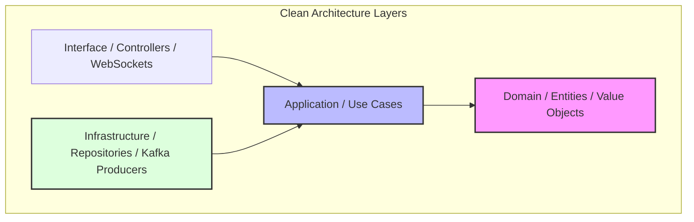
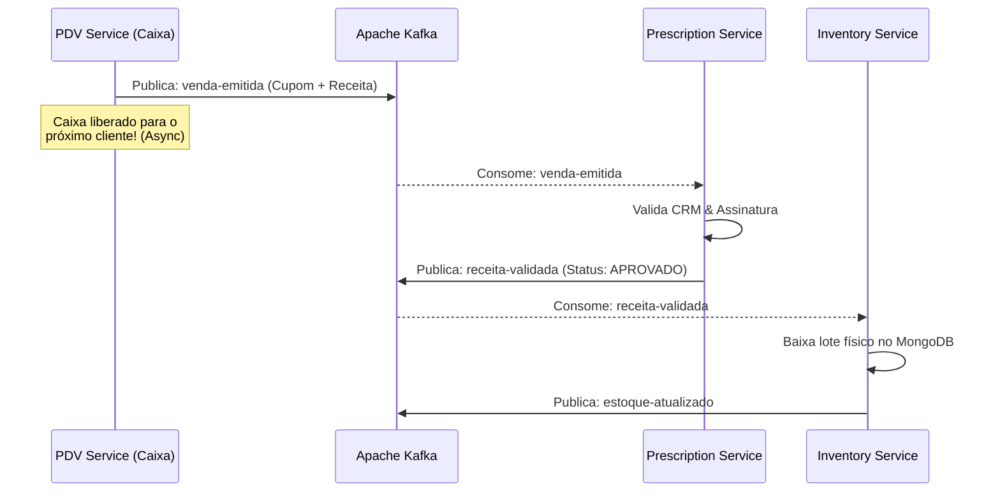

# FarmoSync: Blueprint Arquitetural para PDV de Farmácia de Alta Performance
*Uma arquitetura de referência baseada em DDD, Clean Architecture, Event-Driven (Kafka), MongoDB, Docker e Testcontainers.*

---

## 1. Introdução e o Cenário de Negócio (PDV de Farmácia)

Um Ponto de Venda (PDV) de farmácia opera em um ambiente altamente crítico. Ele exige **baixíssima latência** no momento da venda (o caixa não pode demorar para registrar produtos) e **alta disponibilidade** (se a internet cair ou um serviço externo estiver lento, o caixa não pode travar). 

Ao mesmo tempo, existem regras complexas:
1. **Medicamentos Controlados:** Exigem validação de receitas médicas, registro do médico (CRM/UF) e do paciente.
2. **Rastreabilidade da ANVISA (Lote e Validade):** Não basta dar baixa no estoque do produto "Dipirona 500mg". É preciso registrar que foi vendido o item do **Lote A** com **Validade até X/Y**.
3. **Integrações (PBM/Convênios e Notas Fiscais):** Comunicação com autorizadoras de desconto e SEFAZ.

Para resolver isso, adotamos uma arquitetura de microsserviços **desacoplada e orientada a eventos (Event-Driven)** com **Spring Boot**, **MongoDB**, **Kafka** e **Docker**.

---

## 2. Domain-Driven Design (DDD) & Clean Architecture

Para evitar que o sistema se torne uma "grande bola de lama" (Big Ball of Mud) à medida que novas regras de negócios surjam, dividimos cada microsserviço seguindo os princípios de **DDD** e **Clean Architecture**.



### O Coração do Software: Camada de Domínio (Domain)
A camada de domínio é pura. Ela **não conhece frameworks, bancos de dados ou bibliotecas de terceiros**. Ela é escrita em Java puro (POJOs) e contém as regras mais sagradas do negócio.

*   **Entidades (Entities):** Objetos com identidade única que muda ao longo do tempo (ex: `Venda` com seu ID único).
*   **Objetos de Valor (Value Objects):** Objetos sem identidade própria, definidos apenas por seus atributos (ex: `Lote`, `CRM`, `Endereco`). Eles são imutáveis.
*   **Agregados (Aggregates) e Raízes de Agregado (Aggregate Roots):** Um grupo de objetos associados que tratamos como uma unidade para fins de mudança de dados. No nosso caso, a `Venda` é a Raiz do Agregado, e os `ItensVenda` pertencem a ela. Qualquer alteração em um item deve ser feita através do objeto `Venda`.
*   **Serviços de Domínio (Domain Services):** Regras de negócio que não pertencem naturalmente a uma única entidade (ex: `CalculadoraImpostosMedicamento`).

### A Camada de Aplicação (Application)
Contém os casos de uso do sistema (Use Cases). Ela orquestra o fluxo de dados para dentro e para fora do domínio.
*   Exemplo: `FinalizarVendaUseCase`. Ele busca a venda, valida as regras de negócio chamando o domínio, salva no repositório (via interface) e dispara um evento.

### A Camada de Infraestrutura (Infrastructure)
Esta camada lida com a parte física do sistema: adapters de banco de dados (MongoDB), configurações do Spring, clientes HTTP e produtores/consumidores Kafka.

### Estrutura de Pastas Sugerida para cada Microsserviço:
```text
com.farmosync.pdv
├── domain
│   ├── model          # Entidades (Venda, ItemVenda) e Value Objects (CRM)
│   ├── exception      # Exceções exclusivas de negócio
│   └── repository     # Interfaces de repositório (sem implementação JPA/Mongo)
├── application
│   ├── usecase        # Casos de uso (FinalizarVendaUseCase)
│   └── dto            # DTOs de entrada e saída (Request/Response)
├── infrastructure
│   ├── configuration  # Configurações do Spring Boot, Kafka e Mongo
│   ├── repository     # Implementação real (MongoRepository)
│   ├── messaging      # Producers e Consumers do Kafka (Adapters)
│   └── exception      # Handlers globais de erro
└── presentation       # Controllers REST, WebSockets, DTOs de API
```

---

## 3. Event-Driven Architecture (EDA) com Apache Kafka

A comunicação assíncrona baseada em eventos é a chave para o desacoplamento e a resiliência no FarmoSync.

### Por que usar Kafka em vez de chamadas REST síncronas?
Numa arquitetura síncrona (REST), se o `PDV Service` chamasse o `Prescription Service` diretamente via HTTP, e este estivesse instável ou lento, o caixa da farmácia travaria esperando a resposta. 
Com o **Kafka**, o `PDV Service` publica o evento `VendaCriada` e continua operando. O processamento da receita e a baixa do estoque ocorrem de forma assíncrona. Se o serviço de receitas cair, o evento fica salvo com segurança no Kafka e será processado assim que o serviço voltar, sem perda de dados.



### Padrões Avançados de Resiliência no Kafka para Seniores:

1.  **Garantia de Entrega (Acks = all):**
    Configuração do produtor para garantir que a mensagem seja gravada e replicada em múltiplos brokers do Kafka antes de receber a confirmação de sucesso, evitando perda de dados sensíveis da ANVISA.
2.  **Idempotência:**
    Garantir que se o Kafka reenviar uma mensagem (por oscilação de rede), o consumidor não processe a mesma venda ou a mesma baixa de estoque duas vezes. Usamos chaves de idempotência únicas (ex: `saleId`) validadas no MongoDB antes de cada operação.
3.  **Dead Letter Queue (DLQ):**
    Mensagens que falharem consecutivamente por erros de formato ou lógica não travam o fluxo. Elas são enviadas para um tópico `vendas-erro-dlq` para análise manual ou reprocessamento posterior.
4.  **Transactional Outbox Pattern:**
    Garante que a escrita no banco de dados MongoDB (salvar a venda) e a publicação no Kafka (evento `venda-criada`) ocorram como uma transação atômica única. Se um falhar, tudo falha.

---

## 4. Persistência de Dados Otimizada com MongoDB

Em sistemas de varejo tradicional, bancos relacionais (SQL) são padrão. No entanto, o fluxo de venda de uma farmácia possui características únicas que tornam o **MongoDB** a escolha ideal:

### Benefícios do MongoDB no FarmoSync:
*   **Flexibilidade do Cupom Fiscal:** Uma venda de farmácia pode conter medicamentos comuns, itens de higiene pessoal e medicamentos controlados. Cada um exige dados diferentes. Um banco de dados não-relacional baseado em documentos (JSON) permite salvar essas variações em um único documento sem a necessidade de tabelas associativas com dezenas de colunas nulas.
*   **Performance Extrema de Gravação (Writes):** O MongoDB é altamente otimizado para operações de gravação rápidas. Em horários de pico, centenas de caixas podem registrar vendas simultaneamente sem travamentos de *locks* de linha comuns em bancos SQL.
*   **Rastreamento de Lotes Embutido (Embedded Documents):**
    Podemos modelar o produto e seus lotes como um único agregado:
    ```json
    {
      "_id": "prod-123",
      "nome": "Amoxicilina 500mg",
      "lotes": [
        { "numero": "LOTE-A23", "quantidade": 50, "validade": "2027-12-31" },
        { "numero": "LOTE-B89", "quantidade": 12, "validade": "2026-08-15" }
      ]
    }
    ```
    Atualizar a quantidade do lote específico é feito em uma única operação atômica no MongoDB usando operadores como `$set` e `$elemMatch`.

---

## 5. Estratégia de Testes Automatizados (A Visão Sênior)

Para garantir que modificações na regra de negócio não quebrem o PDV, implementamos uma pirâmide de testes robusta.

### Testes Unitários de Domínio
Focados em testar as regras matemáticas e comportamentais das entidades (`Venda`, `ItemVenda`) usando **JUnit 5** e **Mockito**. Por estarem isolados de frameworks, rodam em milissegundos.

### Testes de Integração com Testcontainers (O Estado da Arte)
Um erro comum de desenvolvedores pleno/júnior é usar bancos em memória (como H2 ou MongoDB integrado fictício) para testes de integração. Esses bancos simulados não possuem os mesmos comportamentos, índices ou queries do banco real de produção.

Para resolver isso, usamos **Testcontainers**. Durante a execução dos testes de integração, o JUnit sobe containers reais no Docker temporariamente:
*   Um container real do **MongoDB**.
*   Um container real do **Kafka**.

Isso garante que os testes de integração simulem com 100% de precisão o comportamento do ambiente produtivo, validando desde as queries do MongoDB até o fluxo de mensagens trafegando pelos tópicos do Kafka.

---

## 6. Conteinerização e DevOps com Docker

Para facilitar o onboarding de novos desenvolvedores e garantir que o sistema rode idêntico em Desenvolvimento, Homologação e Produção, utilizamos **Docker** e **Docker Compose**.

### Otimização de Imagens de Produção (Multi-Stage Build)
Para segurança e performance, não enviamos o JDK completo ou ferramentas de build para produção. Criamos imagens leves usando compilação em múltiplos estágios:

```dockerfile
# Estágio 1: Build da aplicação
FROM maven:3.9.6-eclipse-temurin-17 AS builder
WORKDIR /app
COPY pom.xml .
COPY src ./src
RUN mvn clean package -DskipTests

# Estágio 2: Imagem final para execução (Leve e Segura)
FROM eclipse-temurin:17-jre-alpine
WORKDIR /app
COPY --from=builder /app/target/*.jar app.jar
# Executar a aplicação com usuário não-root por motivos de segurança
RUN addgroup -S spring && adduser -S spring -G spring
USER spring:spring
EXPOSE 8080
ENTRYPOINT ["java", "-jar", "app.jar"]
```

Com o `Docker Compose`, criamos um arquivo global contendo o banco de dados MongoDB, o broker do Kafka (com Zookeeper ou Kraft) e os nossos microsserviços integrados, permitindo subir todo o ecossistema com um único comando: `docker-compose up -d`.

---

## 7. Estudos de Caso Reais (Casos de Sucesso da Indústria)

Grandes empresas do mercado global utilizam exatamente essa arquitetura para garantir alta disponibilidade e escalabilidade:

### 1. Uber (Event-Driven com Kafka e NoSQL)
A Uber utiliza o Kafka como sistema nervoso central. Cada solicitação de viagem, movimentação de motorista no GPS e processamento de pagamento gera eventos no Kafka que alimentam centenas de serviços de forma assíncrona. A consistência dos trajetos e dados dinâmicos é mantida com bancos de dados altamente flexíveis semelhantes ao MongoDB, garantindo que o aplicativo do usuário final nunca trave, mesmo se o sistema de faturamento estiver processando dados em background.

### 2. Grandes Redes de Varejo e E-commerce (Walmart e Target)
Durante a Black Friday, sistemas tradicionais SQL frequentemente enfrentam lentidão devido a concorrência de escrita. Grandes varejistas adotam o MongoDB para gerenciar carrinhos de compras e catálogos dinâmicos de produtos devido à rapidez de leitura e flexibilidade de atributos, integrada ao Kafka para disparar fluxos de pagamento, separação física no estoque (WMS) e emissão de notas fiscais de forma paralela e tolerante a falhas.

---

## 8. Conclusão e Próximos Passos

Esta arquitetura fornece uma base incrivelmente sólida, escalável e moderna para o **FarmoSync**. Ao estruturar o projeto com DDD e Clean Architecture, garantimos que as regras de negócio sanitárias e de vendas fiquem protegidas contra mudanças tecnológicas futuras. Com Kafka e MongoDB, criamos um sistema preparado para alta volumetria e tolerância a falhas físicas.

### Próximo Passo:
1. Criar o arquivo `docker-compose.yml` base contendo o **MongoDB** e o **Kafka**.
2. Inicializar o esqueleto do **PDV Service** utilizando Spring Boot com Java 17/21 e estruturando as pastas segundo o modelo de DDD proposto.

---
> [!IMPORTANT]
> **Lembrete de Código Limpo:** Toda a lógica de negócio principal (cálculos de preço, regras de desconto de convênio e validações de controlado) deve residir no pacote `domain` e nunca vazar para os controllers do Spring ou classes de persistência do MongoDB.

---

## 9. Decisões Arquiteturais Documentadas (ADRs)

Para mais detalhes sobre as decisões fundamentais tomadas durante o ciclo de vida e a evolução técnica do FarmoSync, consulte os seguintes registros formais:

*   **[ADR 001: Padrão Resiliente de Mensageria com Kafka Dead Letter Queue (DLQ)](decisions/0001-kafka-dead-letter-queue.md)** - Documentação detalhada sobre a estratégia de isolamento de falhas corporativas e retentativas físicas no processamento de receitas e estoque.
*   **[ADR 002: Consistência Atômica com Transactional Outbox e Transações ACID no MongoDB](decisions/0002-transactional-outbox-mongodb.md)** - Detalhamento técnico da persistência atômica atrelada às sessões ACID do MongoDB e entrega *at-least-once* via agendador assíncrono.
*   **[ADR 003: Observabilidade e Instrumentação de Métricas com Actuator e Prometheus](decisions/0003-prometheus-actuator-monitoring.md)** - Visão operacional de métricas JVM, pool do MongoDB, latências HTTP e monitoramento de *consumer lag* do Kafka.
*   **[ADR 004: Boas Práticas de Logging Estruturado e Resiliente nos Microsserviços](decisions/0004-logging-best-practices.md)** - Registro sobre injeção do SLF4J, tratamento transparente de exceções críticas e acoplamento com coleta de logs centralizada no Grafana Loki.
