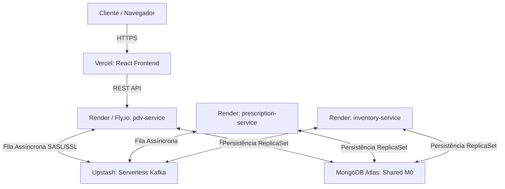

# Guia de Integração e Deploy em Produção: FarmoSync (Back & Front)

Este guia orienta o engenheiro de software no passo a passo para migrar o ecossistema do **FarmoSync** (Monorepo) do ambiente Docker local para uma infraestrutura de produção de alta disponibilidade e custo zero (utilizando planos gratuitos corporativos).

---

## Visão Geral da Arquitetura de Nuvem



---

## PARTE 1: Deploy do Banco de Dados (MongoDB Atlas)

O MongoDB no ambiente de produção deve rodar como um **Replica Set** ativo (necessário para suportar o padrão *Transactional Outbox* e transações ACID da aplicação).

### 1. Criar a Conta e o Cluster
1. Acesse [mongodb.com/atlas](https://www.mongodb.com/cloud/atlas) e crie uma conta gratuita.
2. Crie um novo projeto chamado `FarmoSync`.
3. Clique em **"Create a Cluster"** e selecione a opção gratuita **Shared (M0)** na AWS ou Google Cloud.
4. Escolha um nome para o cluster (ex: `farmosync-cluster`).

### 2. Configurar Segurança de Rede e Acesso
1. Vá em **Database Access** -> **Add New Database User**:
   * Crie um usuário (ex: `farmosync-user`) com uma senha forte.
   * Atribua a permissão **Read and write to any database**.
2. Vá em **Network Access** -> **Add IP Address**:
   * Adicione `0.0.0.0/0` (permite conexões globais para testes) ou configure os IPs específicos dos servidores do backend (Render/Fly.io) para maior segurança.

### 3. Obter a Connection String
1. Clique em **Connect** -> **Drivers**.
2. Copie a string de conexão gerada. Ela terá o formato:
   `mongodb+srv://farmosync-user:<password>@farmosync-cluster.xxxx.mongodb.net/?retryWrites=true&w=majority`

---

## PARTE 2: Deploy da Mensageria (Upstash Serverless Kafka)

Como subir o Apache Kafka na nuvem gratuitamente de forma ultra-veloz usando o **Upstash** (mensageria sem servidor sob demanda).

### 1. Criar o Cluster Kafka
1. Acesse [upstash.com](https://upstash.com) e crie uma conta.
2. No painel, clique na aba **Kafka** -> **Create Cluster**.
3. Nomeie como `farmosync-kafka` e selecione a região mais próxima (ex: `us-east-1` ou `sa-east-1`).
4. Clique em **Create**.

### 2. Criar os Tópicos Necessários
Crie manualmente (ou habilite a auto-criação) os tópicos nos quais nossos microsserviços se comunicam:
*   `venda-emitida`
*   `receita-validada`
*   `estoque-baixado`
*   `vendas-erro-dlq`

### 3. Coletar Credenciais de Conexão
Na aba **Details** do cluster no Upstash, vá em **Spring Boot** ou **Kafka Clients** e copie os parâmetros:
*   **Bootstrap Server:** `xxxx-us-east-1.upstash.io:9092`
*   **SASL Username:** Código de usuário fornecido.
*   **SASL Password:** Token fornecido.

---

## PARTE 3: Deploy dos Microsserviços Java (Render ou Fly.io)

Hospedaremos os 3 contêineres Java utilizando a infraestrutura gratuita do **Render** ou **Fly.io**.

> [!NOTE]
> Apenas o **`pdv-service`** precisa expor uma porta de internet pública (porta `8080` mapeada em um Web Service no Render). O `prescription-service` e o `inventory-service` operam puramente como consumidores e produtores assíncronos em background e podem ser deployados como **Background Workers** no Render.

### 1. Preparar os Dockerfiles Individuais
Se ainda não houver, garanta que cada microsserviço no subdiretório `back/` possua o seu `Dockerfile` otimizado:
```dockerfile
# Exemplo para back/pdv-service/Dockerfile
FROM maven:3.9.6-eclipse-temurin-17-alpine AS build
WORKDIR /workspace
COPY pom.xml .
COPY src src
RUN mvn clean package -DskipTests

FROM eclipse-temurin:17-jre-alpine
WORKDIR /app
COPY --from=build /workspace/target/*.jar app.jar
EXPOSE 8081
ENTRYPOINT ["java","-jar","app.jar"]
```

### 2. Criar as Aplicações no Render
1. Crie uma conta em [render.com](https://render.com).
2. Conecte o repositório GitHub do seu projeto.
3. Para o **`pdv-service`**:
   * Clique em **New** -> **Web Service**.
   * Direcione para a pasta raiz `back/pdv-service`.
   * Configure o runtime como **Docker**.
4. Para o **`prescription-service`** e **`inventory-service`**:
   * Clique em **New** -> **Background Worker** (evita expor portas web desnecessárias).
   * Direcione para a pasta correspondente e defina o runtime como **Docker**.

### 3. Injetar Variáveis de Ambiente no Spring Boot
No painel de cada serviço no Render, vá em **Environment** e configure as seguintes variáveis que o Spring Boot resolverá automaticamente:

| Chave da Variável | Valor (Origem) |
| :--- | :--- |
| `SPRING_DATA_MONGODB_URI` | *Connection String do MongoDB Atlas (Parte 1)* |
| `SPRING_KAFKA_BOOTSTRAP_SERVERS` | *Bootstrap Server do Upstash (Parte 2)* |
| `SPRING_KAFKA_PROPERTIES_SECURITY_PROTOCOL` | `SASL_SSL` |
| `SPRING_KAFKA_PROPERTIES_SASL_MECHANISM` | `PLAIN` |
| `SPRING_KAFKA_PROPERTIES_SASL_JAAS_CONFIG` | `org.apache.kafka.common.security.plain.PlainLoginModule required username="USER" password="PASSWORD";` *(Substituindo pelas credenciais do Upstash)* |

---

## PARTE 4: Deploy do Frontend (Vercel)

A hospedagem do React é extremamente simples e possui plano gratuito vitalício ilimitado.

### 1. Vincular Projeto no Vercel
1. Acesse [vercel.com](https://vercel.com).
2. Clique em **Add New** -> **Project** e importe o repositório do seu monorepo.
3. Configure os seguintes parâmetros na tela de importação:
   * **Framework Preset:** `Vite`
   * **Root Directory:** **`front`**
   * **Build Command:** `npm run build`
   * **Output Directory:** `dist`

### 2. Configurar a Rota da API REST do Backend
No painel do projeto do Vercel, vá em **Settings** -> **Environment Variables** e adicione a variável que conecta com a API pública do nosso `pdv-service` hospedado no Render:

*   **Chave:** `VITE_API_URL`
*   **Valor:** `https://seu-pdv-service.onrender.com/api/v1`

### 3. Deploy
1. Clique em **Deploy**.
2. A Vercel lerá o arquivo [`front/vercel.json`](file:///c:/dev/java-ms/front/vercel.json), aplicará o redirecionamento de rotas amigáveis SPA e disponibilizará o link público seguro HTTPS de homologação instantaneamente!

---

## Checklist de Sucesso de Homologação em Nuvem
* [ ] Banco MongoDB Atlas ativo com Replica Set pronto.
* [ ] Tópicos criados no Kafka do Upstash.
* [ ] Microsserviços compilados em contêineres Docker e rodando no Render com 0 logs de erro.
* [ ] Frontend React acessível via HTTPS na Vercel efetuando requisições contra o IP público do `pdv-service`.
