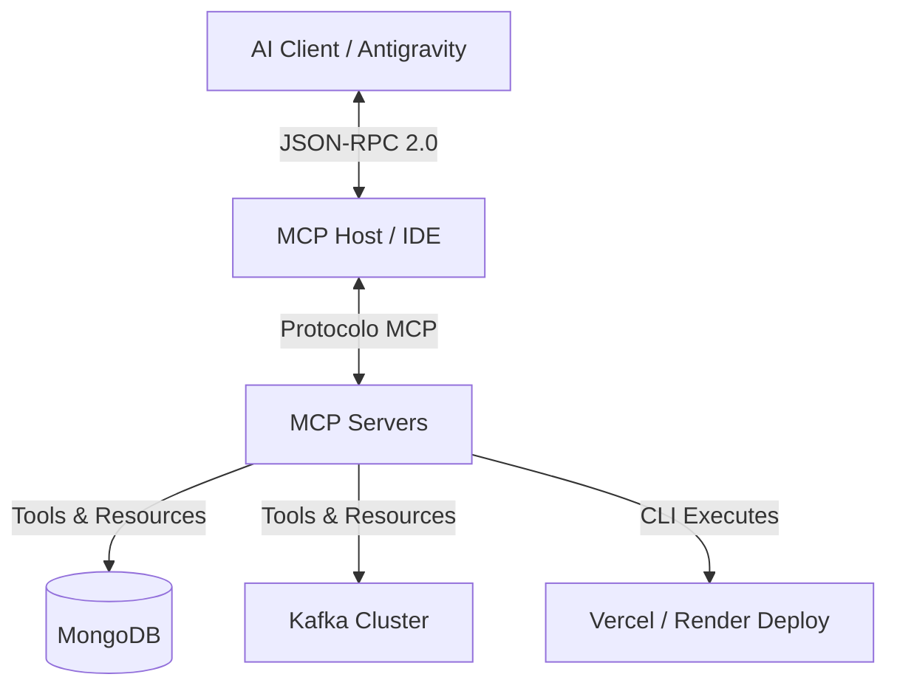
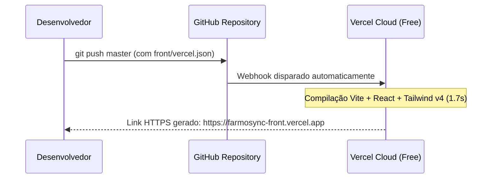

# Pesquisa de Viabilidade Técnica: Model Context Protocol (MCP) no FarmoSync

Este documento analisa a viabilidade, arquitetura e implementação do **Model Context Protocol (MCP)** no ecossistema do **FarmoSync** (Monorepo Java/React), focando em como essa tecnologia pode integrar agentes de Inteligência Artificial com os executores locais, barramentos de mensageria (Kafka), bancos de dados (MongoDB) e pipelines de deploy (Vercel/Render).

---

## 1. O que é o Model Context Protocol (MCP)?

Desenvolvido originalmente como um padrão aberto pela **Anthropic**, o **Model Context Protocol (MCP)** funciona como um "barramento USB-C" para Inteligências Artificial. Ele estabelece um protocolo de comunicação padronizado (baseado em JSON-RPC 2.0) que permite a LLMs e agentes de IA conectarem-se de forma segura e transparente a:

*   **Tools (Ferramentas):** Funções executáveis (ex: realizar uma chamada de API, rodar um script de build, criar uma branch no Git).
*   **Resources (Recursos):** Fontes de dados vivas (ex: ler arquivos locais, inspecionar uma tabela do banco de dados, escutar tópicos do Kafka).
*   **Prompts:** Templates pré-configurados para guiar o comportamento do modelo em tarefas recorrentes.

---

## 2. Viabilidade de Uso para Executores e Deploy

A resposta curta é: **Sim, é extremamente viável e representa o estado da arte para automação conduzida por IA.**

Em vez de programar scripts customizados e proprietários de CI/CD para que um assistente de IA consiga interagir com o seu código, você expõe um **MCP Server de Infraestrutura**. Com isso, a IA consegue gerenciar o ciclo de vida da aplicação de forma dinâmica.

### Cenários Práticos de Deploy via MCP:
1.  **Deploy Contínuo via Prompt:** O agente de IA edita o código do frontend, valida os testes locais e, por meio do **Vercel MCP Server** ou **GitHub MCP Server**, dispara o comando de deploy e retorna o link HTTPS de homologação em tempo real para o usuário.
2.  **Orquestração de Infraestrutura (Docker/Kubernetes):** Um servidor MCP local pode fornecer ferramentas para a IA monitorar a integridade física dos contêineres (`docker ps`, `docker logs`) e reiniciar instâncias travadas automaticamente.
3.  **Hospedagem Gratuita Inteligente:** A IA pode configurar credenciais temporárias em plataformas como **Render** ou **Railway** via chamadas de ferramentas de CLI padronizadas por MCP, automatizando a escalabilidade sem fricção.

---

## 3. Aplicação do MCP no Ecossistema FarmoSync

Podemos desenhar um **Custom MCP Server** específico para o FarmoSync em Node.js ou Java. Ele exporia as seguintes capacidades diretamente para a IA que estiver pareando com você no desenvolvimento:

### A. Ferramentas de Auditoria do Outbox (Kafka/Mongo)
*   **`get_outbox_failures()`**: Consulta a coleção do MongoDB procurando por eventos no estado `FAILED`.
*   **`retry_kafka_event(eventId)`**: Dispara um gatilho de reprocessamento manual do evento da DLQ diretamente para o Kafka.

### B. Ferramentas de Monitoramento de Lotes (Inventory)
*   **`check_expired_batches()`**: Analisa a expiração física de lotes farmacêuticos e gera relatórios de estoque crítico no terminal.

### C. Integração com o Gateway de Segurança
*   **`generate_temporary_jwt()`**: Cria credenciais seguras de teste simulando a autenticação do Keycloak descrita na **ADR 005**.

---

## 4. Como Deployar o Frontend Hoje de Forma Gratuita e Integrada

Para testar a aplicação de imediato em nuvem sem custos, o caminho mais profissional que integra com os nossos arquivos é o seguinte:

### Passo a Passo Resumido do Deploy:
1.  **Subir o Código para o GitHub:** Crie um repositório privado ou público no GitHub contendo o monorepo do FarmoSync.
2.  **Vincular na Vercel:**
    *   Acesse [vercel.com](https://vercel.com) e crie uma conta gratuita.
    *   Clique em **"Add New"** -> **"Project"** e selecione o repositório do FarmoSync.
    *   Nas configurações de diretório raiz, selecione a pasta **`front`**.
    *   O Vercel detectará automaticamente a configuração do Vite e o arquivo [`front/vercel.json`](file:///c:/dev/java-ms/front/vercel.json).
3.  **Pronto!** O Vercel gerará um link permanente de acesso rápido com suporte SSL e atualizações automáticas a cada novo push no Git.

---

## 5. Próximos Passos de Arquitetura de IA

Caso queira implementar o suporte nativo a MCP no ecossistema do FarmoSync para permitir que outros agentes controlem os microsserviços via API:
1.  Criar o diretório `back/mcp-server/`.
2.  Desenvolver um microsserviço enxuto em **Node.js** usando o SDK oficial `@modelcontextprotocol/sdk`.
3.  Expor ferramentas de controle de filas do Kafka de forma assíncrona.

Este ecossistema coloca o FarmoSync na vanguarda tecnológica de sistemas baseados em agentes autônomos!
